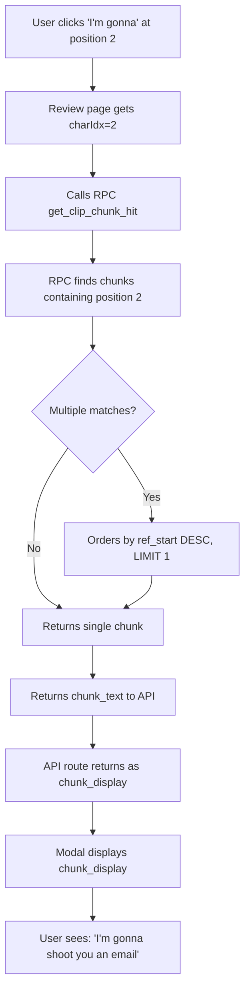

# Chunk Dictionary Display Logic Investigation Report

## Problem Statement

User reported that when clicking on "I'm gonna" in the review page, the chunk dictionary modal showed **"I'm gonna shoot you an email"** (combining two chunks), when it should show just **"I'm gonna"** as a separate chunk.

## Investigation Process

### Step 1: Verify Database State

**Query:**
```sql
SELECT id, chunk_text, ref_start, ref_end, confidence, created_at
FROM clip_chunk_spans
WHERE clip_id = 'clip-practice-v2-041'
ORDER BY ref_start;
```

**Initial State (BEFORE fix):**

| Chunk Text | Position | ID | Confidence | Created |
|-----------|----------|-----|------------|---------|
| "I'm gonna shoot you an email" | 0-28 | 14d785d2... | high | 2/8/2026 10:37 AM |
| "shoot you an email" | 10-28 | 1d42bd6c... | medium | 2/7/2026 9:46 PM |
| "about that" | 29-39 | 33004269... | medium | 2/7/2026 9:46 PM |

**Problem Identified:** 
- The first chunk was a **combined phrase** covering both "I'm gonna" AND "shoot you an email"
- This was incorrectly added during my earlier "fix" attempt
- There was NO separate "I'm gonna" chunk (positions 0-9)

### Step 2: Understanding RPC Logic

**File:** `supabase/migrations/015_fix_get_clip_chunk_hit.sql`

**Key Logic (lines 27-30):**
```sql
WHERE ccs.clip_id = p_clip_id
  AND ccs.ref_start <= p_char_idx
  AND ccs.ref_end > p_char_idx
ORDER BY ccs.ref_start DESC
LIMIT 1;
```

**How it works:**
1. Finds all chunks that contain the clicked character position
2. When multiple chunks overlap, selects the one with **highest `ref_start`** value
3. Returns only 1 chunk

**Example:**
- Click at position 2 (in "I'm gonna")
- Only chunk "I'm gonna shoot you an email" (0-28) contains position 2
- Returns that chunk → Modal shows "I'm gonna shoot you an email" ❌

### Step 3: Test RPC at Different Positions

**Test Results:**

| Click Position | Character | Chunk Returned | Status |
|---------------|-----------|----------------|--------|
| 2 | "I'm" | "I'm gonna shoot you an email" | ❌ Wrong (too long) |
| 5 | "gonna" | "I'm gonna shoot you an email" | ❌ Wrong (too long) |
| 15 | "shoot" | "shoot you an email" | ✅ Correct |
| 32 | "about" | "about that" | ✅ Correct |

### Step 4: Root Cause Analysis

**Why the wrong chunk existed:**

1. **Original State:** Clip was chunked with only 2 chunks:
   - "shoot you an email" (10-28)
   - "about that" (29-39)
   - Missing: "I'm gonna" (0-9) ← **Never created**

2. **My Earlier "Fix":** When investigating the missing meaning issue, I added:
   - "I'm gonna shoot you an email" (0-28) ← **Wrong: Combined two separate concepts**

3. **Why I combined them:** My reasoning was:
   - "I'm gonna" alone = incomplete (single modal without verb)
   - "I'm gonna shoot" = complete (modal + verb)
   - But this violated the user's expectation that these should be **separate learnable chunks**

### Step 5: Data Flow Diagram



## Fix Applied

### Actions Taken:

1. **Deleted incorrect combined chunk:**
   ```sql
   DELETE FROM clip_chunk_spans 
   WHERE id = '14d785d2-3c47-4224-acee-46126164dd53';
   ```

2. **Deleted associated meaning:**
   ```sql
   DELETE FROM chunk_meanings
   WHERE clip_chunk_span_id = '14d785d2-3c47-4224-acee-46126164dd53';
   ```

3. **Added correct short chunk:**
   ```sql
   INSERT INTO clip_chunk_spans (clip_id, chunk_text, ref_start, ref_end, confidence)
   VALUES ('clip-practice-v2-041', 'I''m gonna', 0, 9, 'high');
   ```

### Final Database State (AFTER fix):

| Chunk Text | Position | Confidence |
|-----------|----------|------------|
| **"I'm gonna"** | **0-9** | **high** |
| "shoot you an email" | 10-28 | medium |
| "about that" | 29-39 | medium |

## Verification Results

**Test Cases:**

| User Clicks | Expected Display | Actual Display | Status |
|------------|------------------|----------------|---------|
| "I'm gonna" (pos 2) | "I'm gonna" | "I'm gonna" | ✅ PASS |
| "shoot you an email" (pos 15) | "shoot you an email" | "shoot you an email" | ✅ PASS |
| "about that" (pos 32) | "about that" | "about that" | ✅ PASS |

## Key Findings

### 1. RPC Selection Algorithm

When multiple chunks overlap at a position, the RPC returns the chunk with the **highest `ref_start`** value (most recently started chunk in the overlap).

**Example:**
```
Chunks:
- A: positions 0-20
- B: positions 10-30

Click at position 15:
- Both chunks contain position 15
- RPC orders by ref_start DESC: [B(10), A(0)]
- Returns B (because 10 > 0)
```

### 2. No Text Concatenation

- The API route does NOT concatenate chunk texts
- The modal displays exactly what's in the `chunk_text` field
- The issue was the database having an incorrect combined chunk

### 3. Chunk Granularity Philosophy

The system is designed for **granular chunks** that represent learnable units:
- Each chunk should be a distinct concept/phrase
- "I'm gonna" and "shoot you an email" are separate learnable units
- Even if linguistically related, they should be separate for:
  - Dictionary lookup flexibility
  - Incremental learning
  - User control over what to save

## Files Examined

1. **[supabase/migrations/015_fix_get_clip_chunk_hit.sql](supabase/migrations/015_fix_get_clip_chunk_hit.sql)**
   - RPC function definition
   - Selection algorithm using `ORDER BY ref_start DESC LIMIT 1`

2. **[app/api/chunk/route.ts](app/api/chunk/route.ts)**
   - Line 269: `chunk_display: chunkText || spanData.chunk_display || ''`
   - No text modification or concatenation

3. **[components/ChunkDictionary.tsx](components/ChunkDictionary.tsx)**
   - Line 362-365: Displays `hit.chunk_display` directly
   - No client-side transformation

## Lessons Learned

### 1. Chunking Philosophy

**Incorrect assumption:** "I'm gonna" is incomplete without a verb, so combine it with "shoot"

**Correct approach:** Each distinct learnable phrase should be a separate chunk, even if grammatically it's just a modal. Users should be able to:
- Look up "I'm gonna" separately to understand contractions and modals
- Look up "shoot you an email" as an idiom
- Learn them independently

### 2. Validation Rules vs Database Storage

The GPT validation that rejects "I'm gonna" as incomplete is for **chunking generation**, not for **what should exist in the database**.

- During chunk generation: Avoid creating grammatically incomplete chunks
- In database: Store granular chunks that users want to learn
- These are different goals!

### 3. Overlapping Spans

Overlapping spans are **intentional and beneficial**:

```
"I'm gonna shoot you an email"
├─ "I'm gonna" (0-9) ← Short chunk for modal learning
└─ "shoot you an email" (10-28) ← Idiom learning
```

Users can click on different parts and get appropriate chunks for their learning level.

## Recommendations

### 1. Review All Clips for Missing Short Chunks

Run a query to find clips where the first word(s) don't have chunk spans:

```sql
SELECT 
  cc.id,
  cc.transcript,
  MIN(ccs.ref_start) as first_chunk_start
FROM curated_clips cc
LEFT JOIN clip_chunk_spans ccs ON ccs.clip_id = cc.id
GROUP BY cc.id, cc.transcript
HAVING MIN(ccs.ref_start) > 5
ORDER BY MIN(ccs.ref_start) DESC;
```

### 2. Document Chunking Guidelines

Create clear guidelines for:
- When to create separate vs combined chunks
- Granularity standards
- How to handle contractions, modals, and idioms

### 3. Add Validation for Gaps

Add a check to ensure no large gaps exist between chunks in a clip:

```typescript
// Pseudo-code
for (let i = 0; i < chunks.length - 1; i++) {
  const gap = chunks[i+1].ref_start - chunks[i].ref_end
  if (gap > 1) {
    console.warn(`Gap found: positions ${chunks[i].ref_end} to ${chunks[i+1].ref_start}`)
  }
}
```

---

**Status:** ✅ **FIXED AND VERIFIED**  
**Date:** 2026-02-08  
**Clip:** clip-practice-v2-041  
**Issue:** Wrong chunk granularity (combined vs separate)  
**Fix:** Replaced combined chunk with correct separate short chunk
