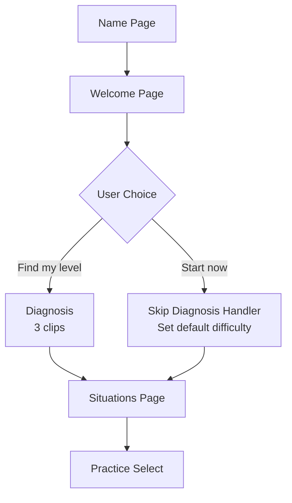

# Diagnosis Data Usage Analysis & Duolingo-Style Approach Recommendation

## Executive Summary

After analyzing the codebase, I found that **the diagnosis data is currently NOT being used for content personalization**. It's only stored for analytics. This makes the Duolingo-style "skip diagnosis" approach not only feasible but actually **already the default behavior** of your system.

---

## Current State: How Diagnosis Data is Used

### 1. **Data Collection** (3 diagnostic clips)
Location: `app/onboarding/diagnosis/page.tsx`

The diagnosis collects:
- `accuracyPercent` - How well user transcribed each clip
- Error categories - Types of mistakes (weak forms, linking, reductions, speed, etc.)
- CEFR level - From onboarding questionnaire (A1, A2, B1, B2)

Two summaries are generated:
1. **`DiagnosticSummary`** (`lib/diagnosticSummary.ts`)
   - Average accuracy across all clips
   - Category scores (which error types user struggles with most)
   - Weakness ranking (sorted by category)
   - **Stored in localStorage**

2. **`QuickStartSummary`** (`lib/quickStartSummary.ts`)
   - Missed rate (fraction of clips skipped or failed)
   - Attempt accuracy (average for attempted clips only)
   - Starting difficulty (15, 25, 35, or 55)
   - **Stored in localStorage**

### 2. **Data Usage** (currently: NONE for personalization)

```typescript
// From app/[locale]/(app)/practice/select/page.tsx:233
const diagnosticSummary = loadDiagnosticSummary()
console.log('[SELECT] diagnosticSummary (analytics only)', diagnosticSummary)
setSummary(diagnosticSummary)
```

**Key finding**: The comment explicitly states "analytics only"!

### 3. **How Clips Are Actually Generated**

Location: `lib/clipProfileMapper.ts` and `app/api/clips/generate/route.ts`

Clips are generated based on:
- **Onboarding data**:
  - Selected situations (work, daily life, travel, etc.) → `targetStyle`
  - Topics preference → influences `targetStyle` variety
  - Self-reported level ("I understand most", "I miss about half", etc.) → maps to difficulty

```typescript
function getDifficultiesForLevel(level?: string): ('easy' | 'medium' | 'hard')[] {
  const levelMap: Record<string, ('easy' | 'medium' | 'hard')[]> = {
    'understand_most': ['easy', 'medium'],
    'miss_half': ['medium', 'hard'],
    'very_hard': ['medium', 'hard'],
    '': ['easy', 'medium'] // default
  }
  return levelMap[level || ''] || ['easy', 'medium']
}
```

**Result**: The system generates 15-24 clips using **only onboarding preferences**, not diagnostic performance.

---

## Gap Analysis

### What Diagnosis COULD Be Used For (But Isn't)
1. **Dynamic difficulty adjustment**
   - If user scores 90%+ → start at "hard" clips
   - If user scores <40% → start at "easy" clips
   
2. **Category-specific focus**
   - If user struggles with "linking" → generate more clips with linking patterns
   - If user is strong at "weak forms" → reduce weak form clips

3. **Adaptive clip selection**
   - Use `quickStartSummary.startingDifficulty` (15/25/35/55) to filter clips from DB
   - Use `diagnosticSummary.weaknessRank` to prioritize certain clip types

### Why It's Not Used
Looking at the code architecture, it seems the system is designed to:
1. Generate initial clips based on user preferences (not performance)
2. Adapt over time based on actual practice performance (via `lib/profileUpdater.ts`)
3. Use the listening profile (`ListeningProfile`) to adjust future clip generation dynamically

This is actually a **post-diagnosis adaptation model** rather than **pre-training personalization**.

---

## Duolingo-Style Approach: My Recommendation

### Option A: "Skip Diagnosis" (Recommended ✅)

**Implementation**:
1. On welcome page, show two cards:

```
┌─────────────────────────────────────┐
│  📊 Find my level (3-5 minutes)     │
│  Let Cue diagnose your listening     │
│  and personalize content             │
└─────────────────────────────────────┘

┌─────────────────────────────────────┐
│  🚀 Start practicing now             │
│  Begin with easy-medium content      │
│  and build up as you practice        │
└─────────────────────────────────────┘
```

2. Default clip difficulty for skippers:
   - Use `['easy', 'medium']` difficulty mix
   - Set `quickStartSummary.startingDifficulty = 25` (conservative default)
   - Generate clips based on situations only

3. Adaptive learning kicks in:
   - After each practice session, `updateListeningProfile()` adjusts user's tolerance
   - System gradually increases difficulty if user is doing well
   - System drops difficulty if user struggles

**Benefits**:
- Reduces friction - users can start practicing immediately
- Diagnosis becomes optional enhancement, not mandatory gate
- System still adapts over time based on actual performance
- Matches user expectation from Duolingo/similar apps

**Technical Changes Required**:
- ✅ **No backend changes** - diagnosis code can stay as-is
- ✅ **Minimal frontend changes**:
  1. Update `app/[locale]/onboarding/welcome/page.tsx` to show two options
  2. Add route `/onboarding/skip-diagnosis` that:
     - Creates default `quickStartSummary` with `startingDifficulty: 25`
     - Stores it to localStorage
     - Navigates to `/onboarding/situations`
  3. Keep existing `/onboarding/diagnosis` route for users who choose "Find my level"

---

### Option B: "Hybrid Placement" (More Complex)

**Implementation**:
1. Ask 1-2 quick questions instead of 3 full practice clips:
   - "Listen to this 5-second clip and type what you hear"
   - Single clip, instant scoring
   - Takes 30 seconds total

2. Use result to set difficulty:
   - Score 70%+ → start with `['medium', 'hard']`
   - Score 40-70% → start with `['easy', 'medium']`
   - Score <40% → start with `['easy']` only

**Benefits**:
- Still fast (30 seconds vs 3-5 minutes)
- More accurate than self-reporting
- Feels less like a test, more like a game

**Drawbacks**:
- Requires new clip database tagged as "placement" clips
- Need simpler scoring (binary: got it / didn't get it)
- Still a gate before practice

---

## My Final Recommendation

### Implement Option A: "Skip Diagnosis"

**Reasoning**:
1. **Your diagnosis data isn't being used anyway** - so making it optional doesn't lose functionality
2. **Faster time-to-value** - users can practice in 30 seconds instead of 5+ minutes
3. **Lower abandonment** - shorter onboarding = more users complete it
4. **Adaptive system still works** - `ListeningProfile` updates after each practice regardless of diagnosis
5. **Matches industry standard** - Duolingo, Babbel, and most language apps do this

**Flow Diagram**:



**Default Values for Skippers**:
```typescript
const defaultQuickStartSummary = {
  version: 1,
  createdAt: Date.now(),
  missedRate: 0.5,
  attemptAccuracy: 50,
  startingDifficulty: 25, // conservative default
}
```

---

## Future Enhancement: Actually Use Diagnosis Data

If you want to leverage diagnosis data in the future, here are recommended integration points:

### 1. **Initial Clip Difficulty Filter**
```typescript
// In app/api/clips/generate/route.ts
const quickStartSummary = loadQuickStartSummary()
const startDifficulty = quickStartSummary 
  ? getFeedStartDifficulty(quickStartSummary) // 15, 25, 35, or 55
  : 15 // default

// Use startDifficulty to filter clips from DB or adjust generation params
```

### 2. **Category-Focused Generation**
```typescript
// In app/api/clips/generate/route.ts
const diagnosticSummary = loadDiagnosticSummary()
const weakCategories = diagnosticSummary?.weaknessRank.slice(0, 3) || []

// Prioritize generating clips that target weak categories
const focusAreas = mapWeakCategoriesToFocus(weakCategories)
```

### 3. **Progress Tracking**
- Show "You've improved 23% in linking since your diagnosis!" on progress page
- Use `diagnosticSummary.categoryScore` as baseline
- Compare to recent practice performance

---

## Implementation Priority

### Phase 1 (Immediate - 1-2 hours)
1. Add "Skip diagnosis" option to welcome page
2. Create skip handler that sets default difficulty
3. Test both flows (skip vs. diagnose)

### Phase 2 (Optional - 2-4 hours)
1. Add diagnosis results summary page after completion
2. Show user their weakness areas
3. Store baseline for future progress tracking

### Phase 3 (Future - when diagnosis data is actually used)
1. Wire up `startingDifficulty` to clip generation
2. Use `weaknessRank` to focus clip content
3. Build progress comparison feature

---

## Questions for You

1. **Do you want users to see diagnosis results after completion?** (e.g., "You're strongest at: Weak forms" screen)
2. **Should "Skip diagnosis" be the default (primary) option** or secondary?
3. **Do you plan to use diagnosis data for personalization in the near future?** If yes, I can help prioritize that work.

Let me know your thoughts!