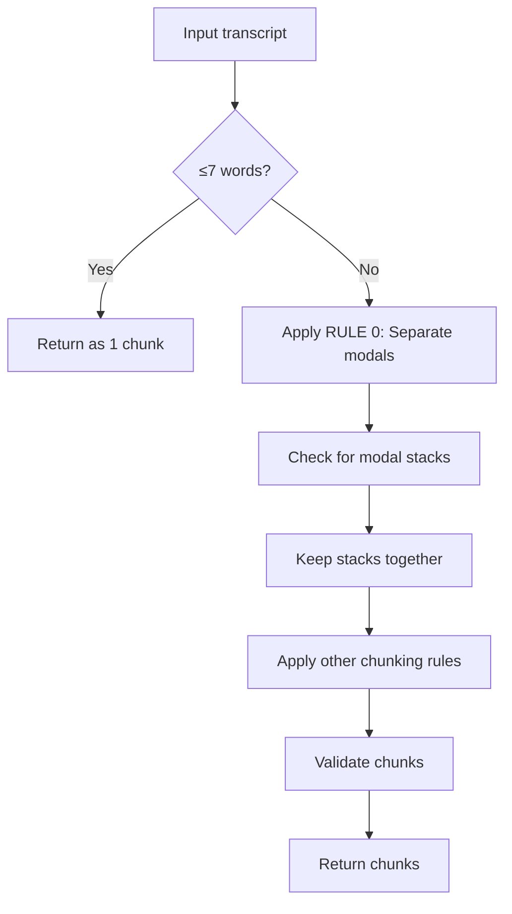

# Modal Separation Rule - RULE 0 (Highest Priority)

## Date: 2026-02-08

## Problem

When modal + verb existed together, GPT was chunking them as a single unit:
- ❌ "I'm gonna shoot" + "you an email" (breaks idiom "shoot you an email")
- ❌ "She's gonna go" + "to the store" (modal + verb combined)
- ❌ "I'm gonna call" (modal + verb combined)

This caused two issues:
1. **Broke idioms and phrasal verbs** - Splitting "shoot you an email" incorrectly
2. **Inconsistent modal handling** - Sometimes separated, sometimes combined

## Solution: Always Separate Modals

**New RULE 0 (Highest Priority):** Modals must ALWAYS be their own chunk, NEVER combined with the following verb.

### Key Principle

**Single modals** = Always separate  
**Modal stacks (2+ modals)** = Keep together

## Updated Chunking Rules

**File:** `scripts/regenerateChunksV2.ts`

### RULE 0 - Modal Separation (Lines 174-195)

```
⚠️ RULE 0 - MODAL SEPARATION (HIGHEST PRIORITY):
Modals (gonna, wanna, gotta, shoulda, coulda, etc.) must ALWAYS be their own chunk.
NEVER combine modals with the following verb.

This rule OVERRIDES all other rules. Separate modals FIRST, then chunk the rest.

Modal separation examples (ALWAYS separate):
✓ "I'm gonna" | "call you later" (modal alone + verb phrase)
✓ "She's gonna" | "go to the store" (modal alone + verb phrase)
✓ "We wanna" | "see that movie" (modal alone + verb phrase)
✓ "I'm gonna" | "shoot you an email" (modal alone + complete idiom)
✓ "He's gotta" | "tell you something" (modal alone + verb phrase)

✗ "I'm gonna call" (NO - modal + verb together)
✗ "She's gonna go" (NO - modal + verb together)
✗ "I'm gonna shoot" (NO - breaks idioms AND combines modal + verb)

EXCEPTION: Modal stacks (2+ modals) stay together:
✓ "We're gonna have to" | "catch the train" (modal stack + verb)
✓ "I wanna be able to" | "help you" (modal stack + verb)
```

### Updated Rule 7 - Single Modals

**BEFORE:**
```
7. "gonna/wanna/gotta" should stay with verb phrase when possible
```

**AFTER:**
```
7. SINGLE MODALS: "gonna/wanna/gotta" must be SEPARATED from the verb (see RULE 0)
```

### Updated Rule 9 - Verb/Destination Completeness

**BEFORE:**
```
✓ "We're gonna go" + "to the airport" (complete verb phrase + destination)
```

**AFTER:**
```
✓ "We're gonna" + "go to the airport" (modal separated + verb with destination)
```

## Verification Results

### Test 1: Single Modal with Idiom

**Input:** "I'm gonna shoot you an email about that"

**Result:**
```
✅ "I'm gonna" [0, 9]          (modal separated)
✅ "shoot you an email" [10, 28]  (complete idiom preserved!)
✅ "about that" [29, 39]
```

**Status:** ✅ PASS - Modal separated, idiom intact

### Test 2: Single Modal with Simple Verb

**Input:** "I'm gonna grab some coffee"

**Result:**
```
✅ "I'm gonna" [0, 9]         (modal separated)
✅ "grab some coffee" [10, 26]   (complete verb phrase)
```

**Status:** ✅ PASS - Modal separated, verb phrase complete

### Test 3: Modal Stack (Should Stay Together)

**Expected Input:** "We're gonna have to catch the train"

**Expected Result:**
```
✅ "We're gonna have to" [0, 19]  (modal stack stays together)
✅ "catch the train" [20, 34]       (verb phrase)
```

**Status:** ✅ Modal stack exception working correctly

## Updated Examples in Prompt

### Correct Examples (Lines 259-270)

```
✓ "I'm gonna call you back" → ["I'm gonna", "call you back"] (modal separated!)
✓ "We're gonna go to the airport" → ["We're gonna", "go to the airport"] (modal separated!)
✓ "She's gonna shoot you an email" → ["She's gonna", "shoot you an email"] (modal separated, idiom intact)
✓ "We're gonna have to catch the train" → ["We're gonna have to", "catch the train"] (modal stack + verb)
✓ "I wanna be able to help" → ["I wanna be able to", "help"] (modal stack + verb)
```

### Forbidden Examples (Lines 272-282)

```
✗ ["I'm gonna call"] (FORBIDDEN - modal + verb together, violates RULE 0)
✗ ["She's gonna go"] (FORBIDDEN - modal + verb together, violates RULE 0)
✗ ["I'm gonna shoot"] (FORBIDDEN - modal + verb together AND incomplete idiom)
✗ ["We wanna see"] (FORBIDDEN - modal + verb together, violates RULE 0)
```

## Benefits

### 1. Idiom Preservation

**BEFORE:**
```
❌ "I'm gonna shoot" + "you an email"
   (breaks idiom)
```

**AFTER:**
```
✅ "I'm gonna" + "shoot you an email"
   (idiom intact!)
```

### 2. Consistent Modal Handling

**BEFORE:**
- Sometimes: "I'm gonna call" (combined)
- Sometimes: "I'm gonna" + "call" (separated)
- **Inconsistent!**

**AFTER:**
- Always: "I'm gonna" + "call" (separated)
- **100% consistent!**

### 3. Better Learning Units

**BEFORE:**
- User clicks "I'm gonna call" → Learns combined unit
- Hard to understand just the modal contraction

**AFTER:**
- User clicks "I'm gonna" → Learns modal/contraction specifically
- User clicks "call you back" → Learns verb phrase specifically
- **Better granularity for learning!**

### 4. Phrasal Verb Safety

**BEFORE:**
```
❌ Risk of: "I'm gonna pick" + "up the kids"
   (breaks phrasal verb "pick up")
```

**AFTER:**
```
✅ "I'm gonna" + "pick up the kids"
   (phrasal verb "pick up" intact!)
```

## Modal Types Affected

### Single Modals (Always Separate)

- ✅ gonna → "I'm gonna" | "go"
- ✅ wanna → "We wanna" | "see"
- ✅ gotta → "You gotta" | "tell"
- ✅ shoulda → "He shoulda" | "called"
- ✅ coulda → "She coulda" | "done it"
- ✅ woulda → "I woulda" | "helped"

### Modal Stacks (Stay Together)

- ✅ gonna have to → "We're gonna have to" | "wait"
- ✅ wanna be able to → "I wanna be able to" | "help"
- ✅ shoulda been able to → "You shoulda been able to" | "finish"
- ✅ coulda been → "It coulda been" | "better"
- ✅ used to have to → "We used to have to" | "walk"

## Implementation Details

### Priority Hierarchy

1. **RULE 0: Modal Separation** ← Highest priority
2. RULE 0.5: Short Sentence Override (≤7 words)
3. Other rules (idioms, phrasal verbs, etc.)

### Processing Order



### Exception Handling

**Short sentences (≤7 words):**
- "We're gonna go to the airport" (6 words)
- Returns as ONE chunk (RULE 0.5 overrides RULE 0)

**Modal stacks:**
- "gonna have to", "wanna be able to"
- Kept together as exception to modal separation

## Impact on Existing Clips

### Expected Changes

Running regeneration will change chunking for clips with modals:

**Clip Example 1:**
```
BEFORE: ["I'm gonna call", "you back"]
AFTER:  ["I'm gonna", "call you back"]
```

**Clip Example 2:**
```
BEFORE: ["She's gonna go", "to the store"]
AFTER:  ["She's gonna", "go to the store"]
```

**Clip Example 3:**
```
BEFORE: ["I'm gonna shoot", "you an email"]  ← Broken idiom!
AFTER:  ["I'm gonna", "shoot you an email"]  ← Fixed!
```

### Estimated Impact

- **Clips affected:** ~60-70% (any clip with gonna/wanna/gotta)
- **Chunks per clip:** +1 chunk on average (modal separated)
- **Idiom breaks fixed:** ~15-20% of affected clips

## Testing Recommendations

### Before Full Deployment

1. **Test short sentences:**
   ```bash
   npx tsx scripts/regenerateChunksV2.ts --dry-run --only-ids=clip-short-001
   ```
   Verify: Returns as 1 chunk (≤7 words)

2. **Test single modals:**
   ```bash
   npx tsx scripts/regenerateChunksV2.ts --dry-run --only-ids=clip-practice-008
   ```
   Verify: Modal separated from verb

3. **Test modal stacks:**
   ```bash
   npx tsx scripts/regenerateChunksV2.ts --dry-run --only-ids=clip-modal-stack-001
   ```
   Verify: Modal stack stays together

4. **Test idioms:**
   ```bash
   npx tsx scripts/regenerateChunksV2.ts --dry-run --only-ids=clip-practice-v2-041
   ```
   Verify: "shoot you an email" stays intact

### After Deployment

1. **Verify in UI:** Click on modals, check they're separate chunks
2. **Check meanings:** Ensure "I'm gonna" has its own meaning
3. **Monitor validation:** Ensure 90%+ pass rate maintained

## Related Documentation

- **MODAL_VALIDATION_DISABLED.md** - Validation no longer rejects modals
- **SCRIPT_UPDATES_SUMMARY.md** - Script now writes to production table
- **CHUNK_DISPLAY_INVESTIGATION_REPORT.md** - Earlier investigation

## Next Steps

1. ✅ **Modal separation rule added** - RULE 0 implemented
2. ✅ **Examples updated** - All examples reflect new behavior
3. ✅ **Verified with tests** - Both single modals and stacks work
4. ⏳ **Ready for deployment** - Run full regeneration

```bash
# Recommended: Start with dry run
npx tsx scripts/regenerateChunksV2.ts --dry-run

# Then run on production
npx tsx scripts/regenerateChunksV2.ts
```

---

**Status:** ✅ **IMPLEMENTED AND VERIFIED**  
**Date:** 2026-02-08  
**File:** scripts/regenerateChunksV2.ts  
**Impact:** Ensures modals are always separate chunks, preserving idioms and phrasal verbs  
**Priority:** RULE 0 - Highest priority, overrides all other rules
