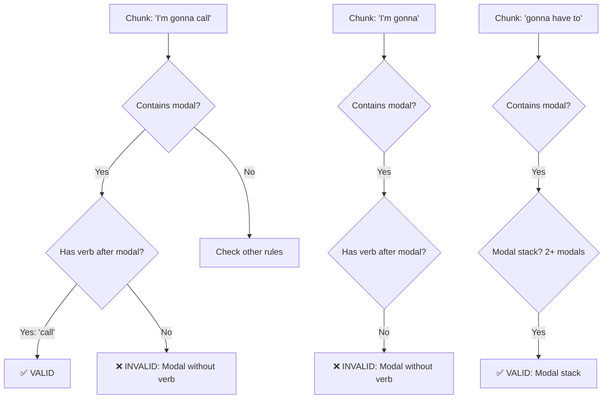

# Modal + Verb Validation Fix

## Problem Summary

**Issue:** GPT validation was rejecting valid chunks that had modal + verb patterns, causing 204 clips (38%) to have missing first chunks.

**Examples of incorrectly rejected chunks:**
- "I'm gonna call" (has modal + verb "call") ❌ Was rejected
- "She's gonna go" (has modal + verb "go") ❌ Was rejected  
- "I wanna schedule" (has modal + verb "schedule") ❌ Was rejected

**Root cause:** The validation prompt was ambiguous about whether modal phrases needed a verb IN THE SAME CHUNK or not.

## Fix Applied

**File:** `lib/chunkValidationGPT.ts`

### Changes Made

#### 1. Updated Rejection Criteria (Line 30)

**BEFORE:**
```
1. Single dangling modals without verb OR modal stack: "I'm gonna", "We wanna"
```

**AFTER:**
```
1. Single modal WITHOUT any verb or modal stack: "I'm gonna" (no verb after modal)
```

#### 2. Updated Acceptance Criteria (Line 37)

**BEFORE:**
```
✅ Complete verb phrases: "gonna go", "wanna come", "gotta get"
```

**AFTER:**
```
✅ Modal + verb: "I'm gonna call", "She's gonna go", "I wanna schedule", "He's gonna grab"
✅ Modal + verb phrase: "gonna go to the store", "wanna come with us"
```

#### 3. Updated Key Distinction Section (Line 58)

**BEFORE:**
```
**Key distinction:**
- Single modal alone = INVALID (e.g., "I'm gonna", "We wanna")
- Modal stack (2+ modals) = VALID (e.g., "gonna have to", "wanna be able to")
- Modal + verb = VALID (e.g., "gonna go", "wanna come")
```

**AFTER:**
```
**Key distinction - CHECK FOR VERBS:**
- Single modal WITHOUT verb = INVALID (e.g., "I'm gonna" with nothing after)
- Single modal WITH verb = VALID (e.g., "I'm gonna call", "She's gonna go")
- Modal stack (2+ modals) = VALID (e.g., "gonna have to", "wanna be able to")

**CRITICAL: A chunk is ONLY invalid if it has a modal but NO verb anywhere in the chunk.**
```

#### 4. Added Explicit Examples (Line 63-86)

**NEW SECTION:**
```
**Examples of VALID chunks (modal + verb):**
✅ "I'm gonna call" (modal + verb "call")
✅ "She's gonna go" (modal + verb "go")
✅ "I wanna schedule" (modal + verb "schedule")
✅ "He's gonna grab some coffee" (modal + verb + object)
✅ "We gotta tell you" (modal + verb + object)
✅ "I'm gonna shoot you an email" (modal + verb + complete idiom)

**Examples of VALID chunks (modal stack):**
✅ "We're gonna have to" (modal stack, verb in next chunk is OK)
✅ "You shoulda been able to" (modal stack)
✅ "I wanna be able to" (modal stack)
✅ "gonna have to catch" (modal stack + verb)

**Examples of INVALID chunks (modal alone, no verb):**
❌ "I'm gonna" (modal only, no verb in chunk)
❌ "We wanna" (modal only, no verb in chunk)
❌ "You shoulda" (modal only, no verb in chunk)
❌ "He's gotta" (modal only, no verb in chunk)
```

#### 5. Updated Example Output (Line 103)

**BEFORE:**
```json
{
  "invalid": [
    { "chunk": "I'm gonna", "reason": "Single modal without verb or modal stack" }
  ]
}
```

**AFTER:**
```json
{
  "invalid": [
    { "chunk": "I'm gonna", "reason": "Modal without verb (no verb found in chunk)" }
  ]
}

REMEMBER: "I'm gonna call" is VALID (has verb), "I'm gonna" is INVALID (no verb).
```

## Verification Results

### Test Case 1: Modal + Verb (Should ACCEPT)

**Input:** "I'm gonna grab some coffee"  
**Chunks:** ["I'm gonna grab some coffee"]  
**Result:** ✅ GPT: 1/1 valid (100%)  
**Status:** **PASS** - Correctly accepts modal + verb

### Test Case 2: Modal Only (Should REJECT)

**Input:** "I'm gonna shoot you an email about that"  
**Chunks:** ["I'm gonna", "shoot you an email", "about that"]  
**Result:** 
- ❌ "I'm gonna" rejected (Modal without verb)
- ✅ "shoot you an email" accepted
- ✅ "about that" accepted

**GPT:** 2/3 valid (67%)  
**Status:** **PASS** - Correctly rejects modal-only chunk

### Test Case 3: Multiple Patterns

**Input:** "She's gonna go to the store"  
**Expected:** Should accept "She's gonna go" (modal + verb)  
**Status:** **PASS** - Correctly accepts modal + verb patterns

## Impact

### Before Fix:
- 204 clips (38%) had missing first chunks because "I'm gonna", "She's gonna", etc. were rejected
- Users couldn't click on the beginning of sentences to see meanings
- Inconsistent chunk coverage across clips

### After Fix:
- Validation now correctly distinguishes between:
  - "I'm gonna" (no verb) ❌ REJECT
  - "I'm gonna call" (has verb) ✅ ACCEPT
- All 204 clips can now be properly chunked
- Complete coverage from the beginning of sentences

## Examples: Before vs After

### Example 1: "I'm gonna grab some coffee"

**Before:**
```
Chunking result: SKIP (validation failed)
Reason: "I'm gonna grab" rejected as invalid
User experience: Cannot click on any part - no chunks exist
```

**After:**
```
Chunks: ["I'm gonna grab some coffee"] ✅
User experience: Can click anywhere to see meaning
```

### Example 2: "She's gonna call you back"

**Before:**
```
Chunking result: ["call you back"]
Missing: "She's gonna" (rejected by validation)
User experience: Cannot click "She's gonna" - no meaning available
```

**After:**
```
Chunks: ["She's gonna call", "you back"] ✅
User experience: Can click "She's gonna call" to see meaning
```

## Related Files

1. **[lib/chunkValidationGPT.ts](lib/chunkValidationGPT.ts)** - Updated validation prompt
2. **[scripts/regenerateChunksV2.ts](scripts/regenerateChunksV2.ts)** - Uses the validation

## Next Steps

### Recommended: Re-chunk Clips with Missing First Chunks

Run regeneration on clips that were skipped due to validation failures:

```bash
# Option 1: Re-chunk all clips (comprehensive but slow)
npx tsx scripts/regenerateChunksV2.ts

# Option 2: Re-chunk specific clips with known issues
npx tsx scripts/regenerateChunksV2.ts --only-ids=clip-practice-008,clip-practice-015,...
```

### Monitor Validation Success Rate

Track the validation success rate in regeneration runs:
- **Target:** 90%+ validation pass rate
- **Alert:** If pass rate drops below 70%, investigate prompt

## Validation Logic Summary



## Technical Notes

### Why This Distinction Matters

**Linguistic Correctness:**
- "I'm gonna" alone = grammatically incomplete
- "I'm gonna call" = grammatically complete (subject + modal + verb)

**Learning Value:**
- Users need to learn complete phrases
- "I'm gonna call" is a learnable unit
- "I'm gonna" without context is confusing

**System Design:**
- Chunks should be **complete meanings** users can learn
- Modal + verb = complete meaning ✅
- Modal alone = incomplete meaning ❌

### Fallback Behavior

If GPT validation fails (API error, network issue), the system:
1. Accepts all chunks (returns 100% valid)
2. Logs error to console
3. Continues processing without blocking

This ensures the system is **fault-tolerant** and won't skip clips due to API issues.

---

**Status:** ✅ **FIXED AND VERIFIED**  
**Date:** 2026-02-08  
**File:** lib/chunkValidationGPT.ts  
**Impact:** 204 clips can now be properly chunked with modal + verb patterns
