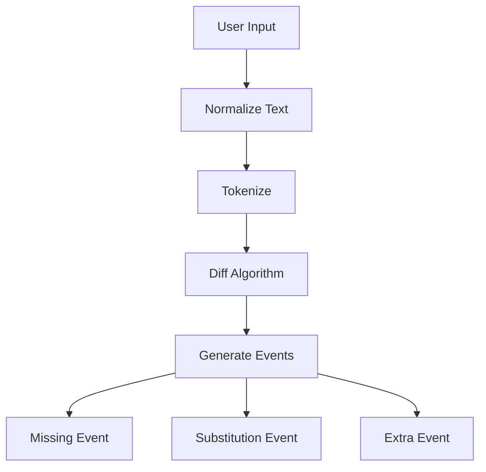
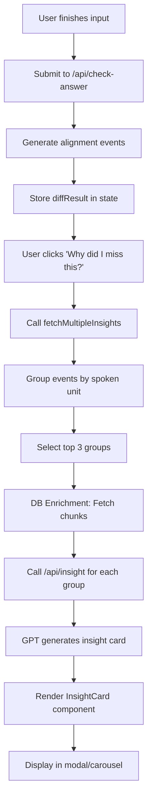

# "Why This Was Hard" Feedback System - Complete Explanation

**Date:** 2026-02-08

## Overview

The "Why this was hard" feedback is shown when users make mistakes during listening practice. This document explains the complete data flow, from user input to displayed feedback.

---

## 1. Where Feedback Content Comes From

### Answer: **Hybrid System**

The feedback uses a **combination of three sources**:

1. **GPT-4o-mini** (Primary) - Generates custom insights via `/api/insight`
2. **Deterministic Fallback** - Rule-based generation when GPT fails
3. **Database Chunks** - Enriches context with pre-generated chunks

**Key Files:**
- `/app/api/insight/route.ts` - GPT generation + fallback logic
- `/lib/pronunciationHints.ts` - Deterministic sound hints
- `/lib/chunkApi.ts` - DB chunk lookup

---

## 2. How Dropped Words Are Determined

### Alignment Algorithm

The system uses **word-level diff/alignment** to identify mistakes.

**File:** `/app/api/check-answer/route.ts`

### Process:



### Event Types:

1. **Missing Event** (`type: 'missing'`)
   - User didn't type a word from the transcript
   - Example: Expected "wanna", user typed "wana" or nothing
   - Data: `expectedSpan: "wanna"`, `actualSpan: null`

2. **Substitution Event** (`type: 'substitution'`)
   - User typed wrong word
   - Example: Expected "wanna", user typed "want to"
   - Data: `expectedSpan: "wanna"`, `actualSpan: "want to"`

3. **Extra Event** (`type: 'extra'`)
   - User added a word that wasn't in transcript
   - Data: `expectedSpan: null`, `actualSpan: "extra-word"`

### Example:

**Transcript:** "I wanna go to the station"  
**User typed:** "I want to go to the staton"

**Events Generated:**
```javascript
[
  { type: 'substitution', expectedSpan: 'wanna', actualSpan: 'want to', refStart: 1, refEnd: 2 },
  { type: 'substitution', expectedSpan: 'station', actualSpan: 'staton', refStart: 5, refEnd: 6 }
]
```

---

## 3. Data Available for Feedback Generation

### Complete Data Structure:

```typescript
interface Event {
  // Core alignment data
  type: 'missing' | 'substitution' | 'extra'
  expectedSpan: string | null  // What should be there
  actualSpan: string | null     // What user typed
  refStart: number              // Token index start
  refEnd: number                // Token index end
  
  // Context enrichment
  phraseHint?: {
    spanText: string            // Larger phrase context (e.g., "I'm gonna")
    ref_start: number
    ref_end: number
  }
  
  // Phonetic/pattern data (from /api/check-answer)
  confidence?: number           // How confident the alignment is
  patternKey?: string          // Pattern type (e.g., "weak_form", "contraction")
}
```

### Additional Context:

From `/api/check-answer` response:
```typescript
interface DiffResult {
  transcript: string           // Original transcript
  userText: string             // What user typed
  events: Event[]              // All mistakes
  refTokens: string[]          // Tokenized transcript
  userTokens: string[]         // Tokenized user input
  stats: {
    totalWords: number
    correctWords: number
    missedWords: number
  }
  patternFeedback: Array<{     // Pattern-level insights
    patternKey: string
    writtenForm: string
    spokenForm: string
    listeningStrategy: string
  }>
}
```

---

## 4. UI Component Location

### Primary Component: `InsightCard`

**File:** `/components/InsightCard.tsx`

**Props:**
```typescript
interface InsightCardProps {
  insight: any        // Insight data from API
  voiceId: string     // For TTS caching
  cardId?: string     // Stable identifier
}
```

### Parent Component: `ReviewPage`

**File:** `/app/[locale]/(app)/practice/review/page.tsx`

**Trigger:** User clicks "💡 Why did I miss this?" button (line 2444)

---

## 5. Complete Data Flow

### Step-by-Step Process:



### Detailed Flow:

#### **Step 1: User Submission** (`/api/check-answer`)

```typescript
POST /api/check-answer
Body: { transcript, userText, clipId }

// Returns:
{
  events: [
    {
      type: 'missing',
      expectedSpan: 'wanna',
      actualSpan: null,
      refStart: 1,
      refEnd: 2,
      phraseHint: { spanText: "I wanna", ref_start: 0, ref_end: 2 }
    }
  ],
  transcript: "I wanna go",
  userText: "I want to go",
  stats: { ... }
}
```

#### **Step 2: Group Events** (Review page, line 1381)

Events are grouped by "spoken unit" (chunk):

```typescript
// Input: Raw events
[
  { expectedSpan: "I'm", refStart: 0 },
  { expectedSpan: "gonna", refStart: 1 },
  { expectedSpan: "call", refStart: 2 }
]

// Output: Grouped by phraseHint or proximity
[
  {
    key: "I'm gonna",
    spoken_unit: "I'm gonna",  // Context phrase
    target_texts: ["I'm", "gonna"],  // What was missed
    heard_texts: [],  // What was typed (if any)
    events: [event1, event2],
    refStart: 0,
    refEnd: 2
  }
]
```

#### **Step 3: Select Top 3** (Line 1398)

Priority algorithm:
1. Groups with `phraseHint` (spoken unit context) ranked higher
2. Multi-token groups ranked higher than single-token
3. Groups overlapping with `patternFeedback` ranked higher
4. Size (number of mistakes) as tiebreaker

Result: Top 3 groups selected for insight generation

#### **Step 4: DB Chunk Enrichment** (Line 1413-1512)

For each top group:
1. Convert token index → character index in transcript
2. Call `fetchChunkHit(clipId, charIdx)` to get DB chunk
3. **If DB chunk found**: Overwrite `spoken_unit` with DB chunk text
4. **If not found**: Keep existing `phraseHint` or derive from tokens

Example:
```typescript
// Before enrichment:
group.spoken_unit = "I'm gonna"  // From phraseHint

// After DB enrichment:
group.spoken_unit = "I'm gonna"  // Confirmed by DB chunk match
group.context_source = 'db'
```

#### **Step 5: Generate Insights** (Line 1555-1570)

For each of the top 3 groups:

```typescript
POST /api/insight
Body: {
  target_text: "wanna",           // What was missed
  heard_text: "want to" | null,   // What was typed (if applicable)
  context_chunk: "I wanna",       // Spoken unit context
  transcript: "I wanna go to the station",
  userText: "I want to go to the station",
  userLocale: "en",
  chunkRefStart: 1,               // For prev/next token context
  chunkRefEnd: 2
}
```

#### **Step 6: GPT Generation** (`/api/insight/route.ts`)

GPT-4o-mini generates:

```typescript
{
  missed_text: "wanna",
  heard_text: "want to",
  context_chunk: "I wanna",
  sound_hint: "Spoken as one unstressed word",  // Display only
  how_it_sounds: {
    compact: "WAN-nuh",  // Stress-based form
    speaking_rate: 1.08
  },
  howSpeak: '"wanna" sounds like "WAN-nuh"',  // TTS text
  example: {
    text: "I wanna learn that skill too.",
    speaking_rate: 1.0
  },
  exampleSpeak: "I wanna learn that skill too."  // TTS text
}
```

**If GPT fails**: Uses deterministic fallback (`generateFallbackCard()`)

#### **Step 7: Display** (`InsightCard.tsx`)

Component renders:
1. **Comparison section**:
   - Missing: "WHAT YOU MISSED: wanna"
   - Substitution: "YOU HEARD: want to" / "ACTUAL: wanna"

2. **Context section** (if context differs from missed text):
   - "IN THIS PHRASE: I wanna"

3. **How it sounds**:
   - Display: "wanna" → "WAN-nuh"
   - TTS button: Speaks howSpeak text

4. **One example**:
   - Display: "I wanna learn that skill too."
   - TTS button: Speaks exampleSpeak text

---

## 6. Current Section Order & Structure

### Display Hierarchy (Top to Bottom):

```
┌─────────────────────────────────────┐
│  1. COMPARISON SECTION              │
│     - YOU HEARD (if substitution)   │
│     - ACTUAL (always)               │
│     OR                              │
│     - WHAT YOU MISSED (if missing)  │
├─────────────────────────────────────┤
│  2. CONTEXT SECTION (optional)      │
│     - IN THIS PHRASE: ...           │
│     (only if context exists and     │
│      differs from missed text)      │
├─────────────────────────────────────┤
│  3. SOUND HINT (optional)           │
│     - One-line explanation          │
│     - Display only, not spoken      │
├─────────────────────────────────────┤
│  4. HOW IT SOUNDS                   │
│     - Visual: "wanna" → "WAN-nuh"   │
│     - TTS play button               │
├─────────────────────────────────────┤
│  5. ONE EXAMPLE                     │
│     - Natural sentence              │
│     - TTS play button               │
└─────────────────────────────────────┘
```

### Section Visibility Rules:

| Section | Condition |
|---------|-----------|
| **YOU HEARD** | Only for substitution events (heardText exists) |
| **WHAT YOU MISSED** | Only for missing events (heardText is null) |
| **ACTUAL** | Always (shows the correct text) |
| **IN THIS PHRASE** | Only if `context_chunk` exists AND differs from `missed_text` |
| **Sound Hint** | Only if `sound_hint` exists |
| **How it sounds** | Only if stress-based form differs from plain text |
| **One example** | Always (if example exists) |

---

## 7. Key Data Sources Summary

### Primary Sources:

1. **Alignment Events** (`/api/check-answer`)
   - What was missed/misheard
   - Token positions
   - Pattern classifications

2. **Phrase Hints** (From alignment or contextual analysis)
   - Larger spoken unit context
   - Used for grouping and context display

3. **DB Chunks** (`/lib/chunkApi.ts`, `fetchChunkHit`)
   - Pre-generated listening chunks
   - Ensures consistency with Chunk Dictionary
   - Overrides phraseHint when available

4. **GPT-4o-mini** (`/api/insight`)
   - Generates custom explanations
   - Creates example sentences
   - Produces pronunciation hints

5. **Deterministic Fallback** (`lib/pronunciationHints.ts`)
   - Rule-based sound hints
   - Simple example sentences
   - Used when GPT fails or unavailable

---

## 8. Example: Complete Flow

### User Input:

**Transcript:** "I wanna go to the station tonight"  
**User typed:** "I want to go to the station tonight"  
**Mistake:** Typed "want to" instead of "wanna"

### Step 1: Alignment

```javascript
event = {
  type: 'substitution',
  expectedSpan: 'wanna',
  actualSpan: 'want to',
  refStart: 1,
  refEnd: 2,
  phraseHint: { spanText: "I wanna", ref_start: 0, ref_end: 2 }
}
```

### Step 2: Grouping

```javascript
group = {
  key: "I wanna",
  spoken_unit: "I wanna",  // From phraseHint
  target_texts: ["wanna"],
  heard_texts: ["want to"],
  events: [event],
  refStart: 1,
  refEnd: 2
}
```

### Step 3: DB Enrichment

```javascript
// Lookup at char index 2 (in "I wanna")
chunkHit = await fetchChunkHit(clipId, 2)
// Returns: { chunk_display: "I wanna", ... }

group.spoken_unit = "I wanna"  // Confirmed by DB
group.context_source = 'db'
```

### Step 4: Insight API Call

```javascript
POST /api/insight
{
  target_text: "wanna",
  heard_text: "want to",
  context_chunk: "I wanna",
  transcript: "I wanna go to the station tonight",
  userText: "I want to go to the station tonight"
}
```

### Step 5: GPT Response

```json
{
  "missed_text": "wanna",
  "heard_text": "want to",
  "context_chunk": "I wanna",
  "sound_hint": "Spoken as one unstressed word",
  "howSpeak": "\"wanna\" sounds like \"WAN-nuh\"",
  "how_it_sounds": {
    "compact": "WAN-nuh"
  },
  "example": {
    "text": "I wanna learn that skill too."
  },
  "exampleSpeak": "I wanna learn that skill too."
}
```

### Step 6: Display

```
┌─────────────────────────────────────┐
│ ❌ YOU HEARD                         │
│    want to                          │
├─────────────────────────────────────┤
│ ✅ ACTUAL                            │
│    wanna                            │
├─────────────────────────────────────┤
│ 📘 IN THIS PHRASE                    │
│    I wanna                          │
├─────────────────────────────────────┤
│ Spoken as one unstressed word       │
│                                     │
│ 👂 How it sounds         [▶]        │
│    "wanna" → "WAN-nuh"              │
├─────────────────────────────────────┤
│ 🔁 One example           [▶]        │
│    I wanna learn that skill too.    │
└─────────────────────────────────────┘
```

---

## 9. Key Files Reference

### Core Logic:
- **`/app/[locale]/(app)/practice/review/page.tsx`** (Lines 1310-1600)
  - Insight fetching orchestration
  - Event grouping
  - DB enrichment
  - Top 3 selection

- **`/app/api/insight/route.ts`**
  - GPT prompt engineering
  - Fallback generation
  - Response formatting

- **`/app/api/check-answer/route.ts`**
  - Alignment algorithm
  - Event generation
  - Pattern detection

### UI Components:
- **`/components/InsightCard.tsx`**
  - Card rendering
  - Section visibility logic
  - TTS integration

- **`/components/WordPopover.tsx`**
  - Modal wrapper
  - Swipe gestures

### Utilities:
- **`/lib/chunkApi.ts`**
  - DB chunk lookup
  - `fetchChunkHit(clipId, charIdx)`

- **`/lib/pronunciationHints.ts`**
  - Deterministic sound hints
  - Stress-based formatting

- **`/lib/mistakePrioritization.ts`**
  - Event grouping logic
  - Priority scoring

---

## 10. Improvement Opportunities

Based on this analysis, here are areas where UX could be improved:

### Current Issues:

1. **Context confusion**: Users may not understand why "I wanna" is shown when they only missed "wanna"

2. **Section ordering**: Context appears after comparison, but logically should come first

3. **TTS clarity**: Sound hint text is display-only but looks like it should be spoken

4. **Multi-word display**: "want to" vs "wanna" - unclear which is singular/plural

### Recommended Changes:

1. **Reorder sections**:
   ```
   1. IN THIS PHRASE (context first)
   2. WHAT YOU MISSED (minimal)
   3. WHAT YOU HEARD (if applicable)
   4. How it sounds
   5. One example
   ```

2. **Clarify context role**:
   - Rename "IN THIS PHRASE" to "PART OF THIS CHUNK" or "SPOKEN TOGETHER"
   - Add explanation: "(This is the full listening chunk)"

3. **Separate display vs speak text**:
   - Visual markers for TTS-enabled sections
   - Gray out display-only text

4. **Show granularity**:
   - Highlight the specific missed part within the context
   - Example: "I [wanna] go to the station" (brackets show what was missed)

---

## 11. Summary

### Quick Reference:

| Question | Answer |
|----------|--------|
| **Where does content come from?** | GPT-4o-mini + Deterministic fallback + DB chunks |
| **How are mistakes detected?** | Word-level diff/alignment algorithm |
| **What data is available?** | Event type, expected/actual text, token positions, context phrases |
| **Where is the UI?** | `InsightCard.tsx` component in modal on review page |
| **How many cards shown?** | Up to 3 (top priority mistakes) |
| **Can it fail?** | Yes, falls back to deterministic generation |
| **Is it cached?** | Yes, per phrase (phraseId key) |

---

**Last Updated:** 2026-02-08  
**Status:** Production system, actively used  
**Next:** UX improvements for context clarity
